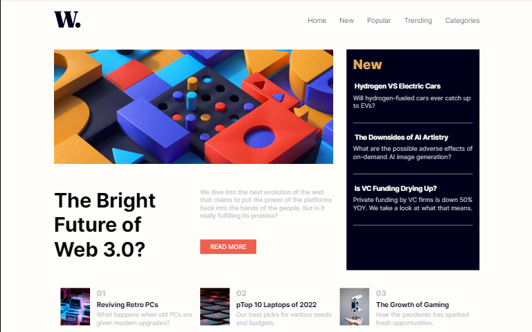

# Frontend Mentor - News homepage solution

This is a solution to the [News homepage challenge on Frontend Mentor](https://www.frontendmentor.io/challenges/news-homepage-H6SWTa1MFl).   
Frontend Mentor challenges help you improve your coding skills by building realistic projects. 

## Table of contents

- [Overview](#overview)
  - [The challenge](#the-challenge)
  - [Screenshot](#screenshot)
  - [Links](#links)
- [My process](#my-process)
  - [Built with](#built-with)
  - [What I learned](#what-i-learned)
  - [Continued development](#continued-development)
  - [Useful resources](#useful-resources)
- [Author](#author)
- [Acknowledgments](#acknowledgments)

## Overview

### The challenge

Users should be able to:

- View the optimal layout for the interface depending on their device's screen size
- See hover and focus states for all interactive elements on the page

## Screenshot

### desktop view
# 
# 

## mobile view

# 
# 

### Links

- Solution URL: [checpout for the code solution in my github repository](https://github.com/moha-tangx/news-home-page)
- Live Site URL: [the live site finished project]( https://moha-tangx.github.io/news-home-page/)

## My process

### Built with

- Semantic HTML5 markup
- CSS custom properties
- Flexbox
- CSS Grid
- Mobile-first workflow

### What I learned

this is one of that kind of small projects you do and end up being super duper Happy with.. I really learnt alot from this project. CSS flex-box use to be my goto option (basically was my only option) when it comes to creating such layouts.with the help of this projecti practiced my CSS grid skills and I really. I didn't used to be a fan of grid but after being frustrated by layouts and trying  creating responsive designs I finally decided to give the grid a try and I love it..  

### Continued development

am looking  foward to using more css grid just to get used to it. there is actually nothing much to it so it is preeyty easy and comes in handy in this kind of situations 

## Author

- Website - [moha_tangx](https://www.your-site.com)
- Frontend Mentor - [@moha_tangx](https://www.frontendmentor.io/profile/moha_tangx)
- Instagram - [@yourusername](https://www.twitter.com/moha_tangx)

## Acknowledgments

A big shoutout to Brad from Traversy Media.
his  css grid crash-course was one of the things  that motivated and helped me accomplish this project and also understaning css grid in general.
I had watched small vedios and read about grid times ago nad got frustrated by it, but his crash-course really helpedand I think he's a good teacher in general he had some other cras-courses on web-dev related subjucts and also a huge contributor to the free-code-camp.
you should probably checkout his youtube channel..  @[Traversy Media](https://www.example.com) 
